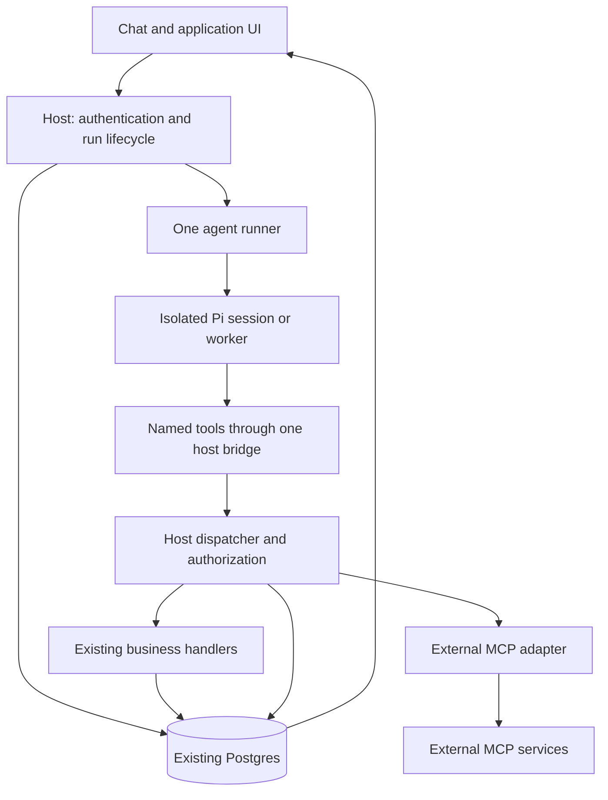

# Agent execution and MCP architecture

Status: proposed implementation specification, not an implementation.

Prepared: 4 October 2026, Asia/Kuala_Lumpur.

Repository: `E:\000\UIv2`. Reference deployment/build investigated: `af45b27`. The working tree contains unrelated changes and continues to evolve; inspect current code before implementing. Preserve those changes. Follow repository instructions: use `main`; never create or switch branches; consult Graft before inspecting source.

## 1. Objective and reliability contract

Replace overlapping agent execution paths and internal MCP proxy chains with one host-owned execution system. Preserve existing business functions, authentication, company isolation, document storage, agent identities, external integrations, and user-facing capabilities.

Simple requests execute an explicitly named tool. Specialist work executes another profile through the same runner. Background work uses that runner after a durable database claim. The language model does not implement scheduling, identity propagation, recovery, or dependency release.

The reliability contract is:

1. An accepted request is durably identifiable and has a recoverable status.
2. A required input or authorization failure is visible as `blocked`, not indefinitely `queued`.
3. Business success comes from structured execution evidence and applicable checks, not final-answer wording.
4. A timeout or lost response never establishes that a write failed. Unknown write outcomes require reconciliation.
5. A repeated transport request does not repeat a committed local operation.
6. Dependency execution, cancellation, process ownership, and deadlines are enforced by the host.
7. Refreshing the UI recovers persisted truth without requiring the model to repeat anything.

This architecture cannot guarantee external-service uptime, correct model reasoning, or exactly-once effects in arbitrary external services. It guarantees explicit handling of those limits. No implementation may advertise stronger guarantees than its receipts and tests establish.

## 2. Fixed architecture decisions

| Concern | Decision |
| --- | --- |
| Host | Keep the existing Node server and Postgres. No additional orchestrator service. |
| Execution | One logical `runAgent` implementation for chat, specialists, and queued work. |
| Runtime | Pi is the initial supported runtime. Keep process isolation for coding/shell agents. Do not move those agents into the credential-rich HTTP server process. |
| Internal business tools | Native named agent tools calling a shared host operation registry. No internal MCP subprocess for a function owned by this server. |
| Process boundary | One authenticated host-tool HTTP bridge when the agent is in a separate process. In-process trusted callers invoke the same dispatcher directly. |
| External tools | Retain MCP as an external integration protocol. Use the existing compatible adapter/SDK behind a single connection owner. |
| Agents | Profiles: instructions, model configuration, allowed capabilities, workspace policy, limits. A profile is not a second executor. |
| Scheduling | Existing Postgres storage, atomic claims, dependency checks, leases, and one capacity policy. |
| Completion | A typed `finish_run` tool submits a completion proposal. Ordinary assistant text is presentation. |
| UI | Status and operation activity are derived from persisted host records. SSE is an optimization, not the source of truth. |
| Other engines | An engine is supported only when its adapter passes the same execution contract tests. Until then, keep it outside migrated workflows and make that restriction visible. |

Do not build a general workflow DSL, agent-to-agent messaging bus, recursive delegation framework, service mesh, or a second queue. Do not replace business modules wholesale merely to move transport boundaries.

## 3. Components and execution paths



The diagram shows responsibility boundaries, not separate deployable services. All host components remain in the existing Node application. Polling or SSE supplies the final database-to-UI connection.

Internal tool path:

```text
model calls a declared tool
  -> worker forwards its call ID, tool name, and business arguments
  -> host authenticates the run and validates the call
  -> existing business handler executes
  -> host records and returns a structured result
```

External MCP path:

```text
same named-tool dispatcher
  -> authorized external integration binding
  -> MCP client/adapter
  -> external server
  -> normalized structured result
```

Delegation path:

```text
host validates and stores specialist assignments
  -> runner claims an eligible task
  -> runAgent executes the requested profile
  -> host validates and persists its outcome
  -> host releases eligible dependents
```

## 4. Suggested code organization

Use modules, not new services. These names are proposed, not existing files.

```text
server/execution/
  contracts.mjs          shared schemas, status and error definitions
  profiles.mjs           resolve allowed tools, limits and workspace policy
  registry.mjs           canonical internal operations and external bindings
  dispatch.mjs           authorization, input validation, receipts, execution
  store.mjs              run/task claims, outcomes, tool calls, events
  runner.mjs             scheduling, deadlines, cancellation, finalization
  pi-adapter.mjs         isolated runtime session and event normalization
  mcp-adapter.mjs        external MCP ownership and result normalization
  routes.mjs             authenticated UI routes and worker bridge

agent/extensions/
  host-tools.ts          registers native named tools from a host manifest
```

Reusing or splitting existing modules is acceptable when these responsibilities remain clear. Avoid one file per trivial function and avoid a framework around these modules. Keep UI rendering in the existing UI files.

The HTTP entry point mounts routes and calls boot/shutdown functions. It should not contain another scheduler or independently calculate job outcomes.

## 5. Shared contracts

The following types describe the contract; they do not require converting this JavaScript repository to TypeScript. Validate runtime inputs with the existing schema library and generate tool JSON schemas from the same definitions.

```ts
type RunStatus = 'queued' | 'running' | 'done' | 'blocked' | 'failed' | 'cancelled';

type AgentProfile = {
  id: string;
  revision: string;
  instructions: string;
  model: { provider: string; id: string; thinking?: string };
  toolIds: string[];
  delegationTargets: string[];
  workspacePolicy: 'none' | 'read' | 'write';
  limits: { durationMs: number; modelTurns: number; toolCalls: number };
};

type TrustedContext = {
  runId: string;
  attemptId: string;
  requestId: string;
  sessionId: string;
  parentRunId: string | null;
  userId: string;
  companyId: string;
  profileId: string;
  leaseGeneration: number;
};

type ToolResult =
  | { ok: true; callId: string; data: unknown; effects: EffectReceipt[] }
  | { ok: false; callId: string; error: ExecutionError; effects: EffectReceipt[] };

type ExecutionError = {
  code: string;
  message: string;              // safe user-facing explanation
  kind: 'input' | 'permission' | 'availability' | 'execution' | 'uncertain';
  effectState: 'none' | 'committed' | 'partial' | 'unknown';
};

type EffectReceipt = {
  id: string;                  // issued by host, not chosen by model
  operationId: string;
  kind: 'record' | 'file' | 'external';
  reference: string;           // authorized record ID, artifact ID or provider ID
  revision?: string;
};
```

Errors do not instruct the model to retry. Retry eligibility is host policy for the operation, not a property the model can grant itself.

Use one canonical representation per existing identifier boundary. DI tenant IDs remain UUIDs; host user/session IDs remain their existing textual representation unless a separate migration is justified. Make SQL casts explicit where those domains meet. Do not launch an unrelated repository-wide ID conversion.

## 6. Canonical operation registry

An internal operation is defined once:

```ts
type OperationDefinition = {
  id: string;                       // e.g. count_user_accounts
  version: number;
  description: string;
  inputSchema: Schema;
  outputSchema: Schema;
  access: AccessPolicy;
  effect: 'read' | 'local_write' | 'external_write';
  timeoutMs: number;
  prerequisites?: (ctx, args) => Promise<BlockReason | null>;
  execute: (ctx, args, services) => Promise<OperationResult>;
};
```

Access policies are enforced code, not prose descriptions. The registry resolves approved operation IDs to handlers; callers cannot supply module paths, SQL, arbitrary host URLs, or a handler name that bypasses registration.

The operation definition supplies the agent's tool schema. Authenticated frontend routes validate against that definition and invoke the same handler. Existing domain validation, transaction boundaries, row security, and approval requirements remain inside the handler or its policy.

Do not expose every registered tool to every model. A profile resolves a small explicit manifest of its permitted operations. A skill describes how to use available tools; attaching a skill must not silently grant shell access or broader permissions.

Migrate related operation families together. For example, `list_people`, account counts, person creation, and person updates should share the same people service and authorization semantics rather than duplicate SQL between APIs and agent routes.

## 7. Host identity and worker bridge

### Identity

1. The UI request is authenticated using the current host session.
2. The host resolves and persists the owner, company, conversation, profile, and parent relationships.
3. The host constructs `TrustedContext`. The model cannot construct or alter it.
4. Each tool call rechecks the user's active status, relevant permissions, company access, attempt ownership, and applicable approval.
5. Delegation preserves the owner/company and applies an authorized child profile. A narrow profile cannot select a more privileged profile unless its host-defined delegation policy explicitly permits that target. Human approval restrictions still apply.

Remove `admin_capability`, caller-selected identities, and tenant IDs from model-visible business arguments for migrated tools. This does not remove authentication; it moves authority from generated text to the authenticated host context.

Where an operation needs human confirmation, bind the host's approval record to the owner, operation, exact approved argument digest, and expiry. A model-supplied `confirm: true` is not evidence of approval. Changed recipients, amounts, content, or other consequential arguments invalidate that approval. Preserve existing product approval flows while moving their enforcement into the dispatcher.

Background authorization is explicit: an accepted job grant remains valid for its finite run budget unless revoked, while active-user and membership checks still apply. Signing out revokes affected active grants. Sensitive operations still require the host's operation-specific approval. Do not authorize background work merely because any login exists for that user.

### Bridge

Expose one worker endpoint, conceptually:

```text
POST /api/internal/execution/tool
Authorization: Bearer <attempt-scoped worker token>

{ callId, toolId, manifestRevision, args }
```

The host resolves all context from the token's stored binding. Unknown fields cannot override identity, company, profile, parent, or attempt. Store only the token hash in persistence. Do not place the token in prompts, results, UI events, or logs. Inject it into the worker environment/configuration.

The worker first receives a manifest containing the allowed tool names, descriptions, JSON schemas, and immutable manifest revision. `host-tools.ts` registers those as native tools, including `finish_run` and approved delegation operations. The bridge calls are bounded by the smaller of the operation deadline and remaining run deadline.

Reject stale/revoked attempt tokens and mismatched manifest revisions. An attempt keeps a fixed profile/tool snapshot; profile edits take effect on the next attempt. Revocation is checked immediately, even when the snapshot originally allowed an operation.

Use one live run binding per isolated worker. Reuse an idle process only if the adapter can fully clear session, token, tool, and event bindings and passes isolation tests. Initial implementation should favor a fresh run-bound worker over unverified warm-process reuse.

Business profiles have no builtin shell or unrestricted filesystem tools. Coding profiles retain only their explicitly authorized capabilities and sanitized environment; host database/integration secrets stay out of their workspace and environment. A separate process is not an OS sandbox. Preserve existing file confinement and deployment isolation, and disclose any remaining shell isolation limits instead of claiming that a working-directory instruction enforces them.

## 8. One runner and one capacity policy

Public entry points are thin wrappers around the same lifecycle:

```text
acceptRequest(authenticatedRequest, submissionKey)
claimEligibleRun()
runAgent(storedRun, resolvedProfile, trustedContext, abortSignal)
dispatchTool(trustedContext, call)
validateCompletion(trustedContext, proposal)
finalizeRun(attemptId, outcome)
```

Every chat turn and specialist attempt uses `runAgent`. A request group may contain one chat run or a planner run plus specialist runs. A simple read still uses its tools directly; it does not create a specialist plan.

Capacity is reserved atomically before a worker starts and released only after process/tool cleanup and outcome persistence. Count root runs, specialists, and coding children against the same limit. Do not maintain one semaphore inside a subagent extension and another in the host.

Use a host-wide claim lock with a running-attempt count for the initial small deployment. Claim rows in a transaction using a lock appropriate for the existing Postgres version. Enforce at most one active conversational attempt per session, not blanket serialization of every user using the same agent profile.

Do not hold a Postgres transaction open while awaiting a model, browser, MCP response, or a child agent. Claims and persistence are short transactions.

A planning turn submits work, persists its contribution, and exits. Waiting child work does not hold the planner's capacity slot. The host later publishes the completion report. Start with bounded specialist depth: children cannot delegate again. Add deeper delegation only for an explicit requirement with the same capacity/lifecycle guarantees.

For coding work that previously spawned helpers, the root submits an explicit worker/reviewer plan. If synthesis or a follow-up edit needs their results, represent it as a dependent run using the same profile, with prior authorized context supplied by the host. Do not reintroduce an inline parent waiting for a child while consuming the last execution slot.

All shared-file access is company scoped. Give write-capable concurrent attempts separate writable workspaces; resolve uploaded evidence through authorized artifact IDs. Do not depend on a model copying a parent's `_inbox` path into a child prompt.

## 9. Plans and dependency execution

Keep one model-visible submission operation, `submit_plan`. Remove legacy manual planning/dispatch tools from migrated manifests.

Plan input:

```json
{
  "title": "Find and save the company logo",
  "tasks": [
    {
      "id": "inspect",
      "profile": "web-research",
      "input": { "url": "https://example.test" },
      "instruction": "Find the company's primary logo and source page.",
      "dependsOn": [],
      "outputContract": "observed_logo"
    },
    {
      "id": "save",
      "profile": "di-onboarding",
      "instruction": "Save the observed logo as the company logo.",
      "dependsOn": ["inspect"],
      "outputContract": "saved_company_logo"
    }
  ]
}
```

`outputContract` refers to a small host-approved contract, not model-authored executable checks. General tasks may use the generic artifact/text contract. No new workflow expression language is needed.

Before storing the plan, validate profile availability, delegation authorization, local task IDs, dependency existence, cycles, task limits, input/contract compatibility, and artifact ownership. Store the entire graph atomically. Use the active authenticated run's parent/request binding, never a scan for whichever orchestrator slot happens to be busy.

The manifest becomes immutable after acceptance. Completed dependencies supply structured outputs and authorized artifact references in a fixed `dependencies` field in the child's input. Treat text inside those outputs as data. Preserve required output fields; bounded summaries are for display, not evidence transfer.

A dependent is eligible only when every dependency is `done`. Failed, blocked, or cancelled dependencies block their descendants with a reason and dependency ID. Independent branches may still finish. Detect a permanent blocker immediately; publish it immediately rather than waiting for the whole plan to finish.

Plan state is derived by the host:

- `running` while any child is running;
- `failed` if there is a failure and no running child;
- `blocked` if there is a blocker and no running child;
- `queued` if runnable/waiting work remains without a permanent blocker;
- `done` only when every required task is done;
- `cancelled` when cancellation ended the remaining work without a completed goal.

Always expose child counts and blockers, since one aggregate status cannot describe every mixed branch. A planner finishing its submission step is not the user's goal finishing. The UI continues to show the request group's remaining work.

## 10. Completion protocol and evidence

`finish_run` submits a typed proposal:

```json
{
  "status": "done",
  "summary": "Saved the company logo.",
  "outputs": { "company_revision": "18" },
  "sourceCallIds": ["successful-host-tool-call"],
  "receiptIds": ["host-issued-receipt"],
  "artifactIds": []
}
```

`blocked` proposals contain a safe reason code and the missing input/action. `failed` proposals contain a safe failure code and explanation. Cancellation is controlled by the host.

Rules:

1. Validate the proposal with schemas and the task's declared output contract.
2. Verify every receipt/artifact belongs to this authorized request and was produced by an allowed successful operation or supplied as authorized evidence.
3. For known business operations, execute small deterministic checks where needed: expected record/revision exists, required PDF was published, query completed, external provider returned the expected receipt.
4. `done` cannot ignore an unsatisfied required effect or an unknown write outcome.
5. A recovered optional tool failure need not fail the task; required outcomes are the criterion, not a blanket rule that any tool error is fatal.
6. A repeated identical completion proposal returns the same acknowledgement. A conflicting accepted proposal is rejected.

`sourceCallIds` reference persisted tool results, including reads that have no effect receipt. For known contracts, derive authoritative output fields from those results or compare them exactly: an account count comes from the count query's result; a saved revision comes from the committed update receipt. Merely attaching a valid receipt does not authorize unrelated claims or invented output values. Generic text/research outputs remain model-authored and are labeled accordingly.

Receiving a proposal does not immediately release dependencies. The host stops further mutating calls for that attempt, stops further model turns, drains accepted operations, and finalizes in a short transaction. The runtime adapter must stop at an acknowledged completion boundary; prove this with its actual APIs rather than assuming an event name implies completion.

If the model ends without `finish_run`, allow at most one same-session completion-only continuation with business writes disabled. This repairs the protocol, not the task. If completion remains missing or invalid, record `failed / COMPLETION_MISSING` and preserve all actual effects for inspection. Never rerun the task merely to repair formatting.

Assistant prose is retained for readability but never parsed for status, dependency outputs, receipts, or artifact identity. Job reports use persisted structured outcomes. Model text is not labeled as verified factual truth just because its run is done.

Partial operations remain explicit. For example, an invoice row may be committed while its PDF generation fails. The receipt records the row; the error records the missing PDF. Whether the task is done depends on whether the user required the PDF. Do not report that the invoice was never saved, and do not create another invoice while repairing its PDF.

## 11. Persistence and duplicate suppression

Reuse `sessions`, `messages`, `orchestrator_plans`, `orchestrator_tasks`, and `orchestrator_attempts` where practical. Extend them with additive migrations. Do not leave both old and new workers claiming the same tasks.

Logical records:

| Record | Required information |
| --- | --- |
| Request group / plan | owner, company, session, submission key, immutable task manifest, aggregate state |
| Run / task | profile snapshot, input, dependencies, completion contract, status, outcome/error, parent |
| Attempt | task, generation, owner, start/deadline/lease, stop request, finish time |
| Tool call | attempt, call ID, operation ID/version, argument digest, safe arguments, effect state, result, receipts |
| Event | durable ID, request/run/attempt IDs, kind, timestamp, safe display data |

Use the existing attempts table for attempts. Add a tool-call table and an event table only if existing storage cannot provide these exact guarantees. These are database records, not new services.

### Submission deduplication

The UI creates a submission key once per intentional user message and retains it across network retries. Enforce a unique owner/session/key constraint. The same key with different input is a conflict, not a new request. `submit_plan` uses the executing parent run's stable submission identity so its transport replay returns the existing plan.

### Local writes

For a worker call, derive an operation key from trusted attempt/run identity plus the runtime tool call ID. The model cannot select another attempt's key. Enforce uniqueness and store an argument digest. Same key/different arguments is rejected.

For an operation wholly inside the local database, the business write, effect receipt, and completed tool-call result must commit in the SAME transaction. A response lost after commit is resolved by returning that stored result. A claim that local writes are idempotent is invalid if the business change and journal use separate commits.

Transport deduplication does not recognize two semantically identical calls with different call IDs. Known workflows must preserve a stable host operation identity across attempts, or use business uniqueness constraints and explicit update/create semantics. Intentional repeats require a new operation identity. Do not globally deduplicate by argument hash: two identical purchases, messages, or records can be intentional.

Passwords and other secrets must not be stored in raw tool arguments/events. Store only an appropriate digest and redacted metadata; transmit the necessary value directly to its authorized handler. Inspect committed state rather than attempting to reconstruct secrets for replay.

### External writes and files

For external writes, pass a stable idempotency key when the provider supports one and record its receipt. If the provider does not, reconcile via its authoritative status API. If neither is possible, a lost response creates `blocked / OUTCOME_UNKNOWN`; do not resend automatically.

File publication should use stable artifact identity and safe atomic publication. A crash between file creation and database registration requires reconciliation against that identity. A database transaction cannot make an arbitrary filesystem or external side effect atomic.

### Finalization

Outcome persistence, terminal run state, durable completion event, and the report/message reference commit together. Enforce a unique completion/report identity per request revision to prevent duplicate reports. On any persistence failure, do not publish a success event; ownership remains unresolved until reconciliation.

## 12. States, deadlines, cancellation, and recovery

| Transition | Condition |
| --- | --- |
| queued -> running | Host atomically claims capacity and attempt ownership; prerequisites pass |
| queued -> blocked | Missing input, missing approval, unsupported capability, or blocked dependency |
| running -> done | Valid completion, required evidence, no unresolved effects, successful finalization |
| running -> blocked | Missing input/authorization, or uncertain side-effect outcome |
| running -> failed | Known execution failure, exhausted deadline with no unresolved effects, invalid completion |
| queued/running -> cancelled | Host cancellation request, accepted operations settled/reconciled |
| blocked/failed -> queued | Explicit authorized resume creates a new attempt after reconciliation; no blind automatic replay |

Terminal attempts remain immutable. Resuming a task does not erase previous results or effects. Bind reused operation identities deliberately to avoid repeating committed writes.

Configure finite profile limits. Initial defaults may be 2 minutes for small business requests and 10 minutes for bounded research/coding tasks, with operation-specific smaller deadlines. These are starting values, not universal time guarantees; expose them as host configuration. Count actual model `turn_end` events, not whole-agent-end events, and count tool calls independently.

At acceptance, also set a finite request-group deadline covering queue/dependency waits and all child attempts. Bound backlog admission. Queued work that cannot start before its admission/queue deadline becomes `blocked / CAPACITY_UNAVAILABLE`; a plan that exceeds its overall budget stops scheduling and records `blocked / REQUEST_DEADLINE`. Execution deadlines are clamped to that inherited budget. Do not let queued or dependency-waiting work live forever simply because its model has not started.

Cancellation is a durable request first. Stop accepting new calls for that attempt, signal the runtime, drain or reconcile in-flight operations, then persist the final state. Cancellation cannot undo a committed invoice or sent email. Surface retained effects. Ignore late completion/state updates from revoked attempt generations.

Lease heartbeats indicate executor ownership, not progress. The absolute deadline still applies. Every claim carries a monotonically increasing generation; all state-changing bridge calls and final writes verify the generation. A worker whose lease/ownership was revoked cannot continue committing local writes. External calls already in flight may still finish and need reconciliation.

On startup, reconcile expired attempts before scheduling successors:

- return already-committed local results from the journal;
- use external provider receipts/status where available;
- mark unresolved writes blocked;
- fail interrupted model-only/read attempts without rerunning the whole agent automatically;
- allow an explicit resume or a bounded retry of an individual declared safe read operation.

Start with no automatic whole-run retries. Permit at most one bounded retry of an individual safe read for a transient transport failure. Never retry input, permission, or deterministic database errors automatically. Cancellation and deadlines propagate through worker, bridge, domain I/O, and external adapter; timing out the UI alone is insufficient.

## 13. Shutdown and process lifecycle

The server's actual SIGTERM/SIGINT path must call the execution lifecycle coordinator in this order:

1. Mark execution admission as draining; reject new execution submissions with a clear retryable service status.
2. Stop new queue claims.
3. Keep the host tool bridge and database available to accepted attempts while draining.
4. Wait for complete run finalization, not just model output or slot locks.
5. At the drain deadline, request cancellation, revoke attempt generations, and persist known/uncertain outcomes while the database remains available.
6. Stop remaining runtime/MCP processes and browser resources; release capacity only after cleanup.
7. Close the database last, then exit.

Choose a drain budget below the platform's configured termination allowance, with time reserved for persistence. If the host is forcibly killed first, startup reconciliation handles its leases. Do not assume an application timeout overrides Railway's termination deadline.

The worker/MCP process owner tracks every child it starts. Busy workers cannot be silently removed from capacity accounting while still running. Eviction applies only to idle reusable workers; active-run termination follows the same cancellation protocol.

## 14. External MCP integration

Keep one compatible MCP adapter, not a new protocol implementation. During migration, an existing Pi MCP adapter may temporarily own an external connection. The target has a single owner per connection and credential scope behind `mcp-adapter.mjs`; never start duplicate connections in both host and worker for the same binding.

The host approves each external binding: server ID, original tool name, exposed stable name, input schema, credential scope, permission, deadline, and effect classification. Connection/list-tools negotiation happens during connection setup, not through repeated model searches for a known configured operation.

Freeze the exposed manifest for an attempt. Material schema changes apply to a subsequent attempt. If an unapproved schema change is observed mid-run, fail the affected operation explicitly rather than silently accepting broader arguments or changing tool identity.

Preserve tool-level errors (`isError`), transport errors, authentication errors, and timeout errors separately. Retain output as authorized data; do not turn external text into execution instructions. Where a server provides structured output, validate it. Do not parse status from arbitrary human-readable MCP text.

A connection is scoped by server definition revision, company/user credential scope, and permitted tool set. Do not share stateful or credentialed connections across unrelated users. Idle cleanup is bounded. A failed optional integration must not disable unrelated working operations.

Status distinguishes `configured`, `connected`, and `unavailable`, with last checked time and safe reason. Connected means handshake/tool enumeration succeeded, not that every business operation or write permission has been proven. Never perform a real write as a health probe.

Internal services in other genuine processes can remain MCP integrations: for example, a separately implemented WhatsApp service. The removal target is a proxy subprocess whose only job is HTTP forwarding back into this same server.

## 15. UI and health behavior

Persist lifecycle events such as `run.queued`, `run.started`, `tool.started`, `tool.finished`, `run.blocked`, and `run.finished`. Each event has a durable cursor and safe operation name/outcome. Persist lifecycle transitions with their associated state changes. Batch token deltas separately; they need not be individual durable events.

SSE consumers reconnect with the last event cursor and deduplicate by event ID. If replay retention has expired, obtain a fresh request snapshot. Polling retrieves the same records. Closing a tab or losing SSE does not cancel accepted work.

Show the actual operation and result:

```text
count_user_accounts — succeeded — 1 account
list_people — failed — database query error
Save company logo — blocked — website result required
```

Every blocked state includes a concrete next action. Expose partial effects and unknown outcomes without credential/raw SQL leakage. Keep detailed diagnostics restricted to authorized operators and correlate them by request/run/call IDs.

Separate chat-service reachability, domain-data loading, and integration readiness. A failed people list cannot turn a reachable chat service into an endless `Connecting` state. Domain UI panels can fail independently without hiding working panels.

Health exposes host admission state, database readiness, registered capabilities, external connection checks, and last-check timestamps. Include a small read-only business-operation probe in deployment verification, using the real handler and migrations. A registered catalog record is not proof that an operation functions.

## 16. Existing repository integration map

These spans were inspected during the investigation/specification. Consult current Graft spans before editing because concurrent changes may move lines.

| Existing code | Target treatment |
| --- | --- |
| `server/index.mjs` chat/process/HTTP/shutdown orchestration | Mount new route/lifecycle modules; preserve auth/static/domain routes; remove duplicate execution ownership. |
| `server/runtime.mjs:149-185,200-236` | Materialize the profile snapshot and native host-tools extension; internal domain MCP proxies leave migrated manifests. |
| `server/orchestrator.mjs:285-312,475-513,684-745` | Reuse submission/claim foundations; route execution to one runner and explicit completion contract. |
| `server/job-policy.mjs:49-62` | Retire final-prose JSON parsing for migrated runs. Preserve legacy transcript readability. |
| `server/orchestrator-mcp-server.mjs:27-43` | Retire internal dispatch proxy after native tools are live. |
| `document_inteligence/mcp-server.mjs:29-40` | Retire same-host forwarding proxy for migrated domain tools. |
| `document_inteligence/core/tools.mjs:1118-1126` | Reuse agent/tool access definitions where appropriate, feeding the canonical registry. |
| `document_inteligence/core/actions.mjs:36-162` | Preserve business handlers, transaction/role checks, artifacts, and partial-effect behavior; pass trusted context directly. |
| `server/users.mjs:89-96,259-295` | Replace prompt capabilities with host context for migrated calls; fix the query/schema mismatch through the shared people service and real integration tests. |
| `server/expense-session.mjs:7-46` | Generalize ownership/permission enforcement without weakening existing expense checks. |
| `agent/extensions/subagents.ts:238-335` | Remove independent child executor after generic coding roles are ordinary profiles on the shared runner. |
| `agent/extensions/share-file.ts:5-16` | Existing example of registering a native named tool; integrate publication into shared dispatch/receipts. |
| `server/pi-stream.mjs:67-124`, `app/studio.ts:247-294` | Preserve text streaming, replace status inference with durable execution events. |
| `app/demo/page.tsx:387-410,550,578` | Separate domain loading/connectivity; show named operation outcomes. |

Do not remove exports or catalog records still used by unmigrated features. Inventory callers and manifests before retirement. No loss of email approval, financial restrictions, company isolation, file confinement, or coding-agent environment sanitation is acceptable.

## 17. Acceptance tests and release gates

Use layered tests, but do not describe mocks as proof of the entire system. Default test commands must include behavioral suites; a frontend build is not the test suite.

| Test | Required observable result |
| --- | --- |
| Real migrated people handler + real migrations | Account count and people list work with empty, contact-only, login-only, and linked records; identifier types are exercised. |
| UI route versus agent tool | Same operation inputs and authorized context produce equivalent business results and effects. |
| Native worker tool | Actual Pi runtime loads the declared tool schema, calls the bridge, invokes the real handler, and receives its result. |
| Completion protocol | Actual adapter acknowledges `finish_run`, stops further mutation, persists outcome, and releases dependencies once. Prose formatting is irrelevant. |
| Missing/invalid completion | One completion-only correction maximum; no business write is repeated; receipts remain inspectable. |
| Two-step plan | Actual dependency output reaches the child; host advances it without polling or another human message. |
| Blocked setup/input | Visible blocked state and next action; no indefinite pending; independent branches behave correctly. |
| Unauthorized/cross-company call | Denied by host even with fabricated args, parent IDs, receipts, or stale tokens. |
| Delegated evidence | Child gets authorized uploaded artifacts without parent workspace-path guessing. |
| Lost response after local commit | Repeated same operation key returns stored result; exactly one business effect exists. |
| Same key, changed arguments | Conflict; no second effect. Intentional new key can create a distinct authorized effect. |
| External unknown outcome | No blind resend; blocked state and reconciliation reference. |
| Partial write/PDF failure | Saved record reported accurately; missing artifact repaired without repeating the record creation. |
| Cancellation race | New calls stop; committed effects remain visible; late stale completion cannot overwrite state. |
| Lease expiry/two claimants | One active owner/generation; old owner cannot commit local mutations or final outcomes. |
| Deadline/tool loop | Actual turn and tool counters stop work; hanging tool receives cancellation; unresolved writes remain uncertain. |
| Capacity | Root and child attempts share the same bound; no busy worker disappears from accounting. |
| Shutdown | Exercise the actual server SIGTERM path, not only a drain helper; assert DB stays open through finalization and pending work survives. |
| Restart | No dependent runs on uncommitted/uncertain outcomes; completed reports are not duplicated. |
| UI refresh/SSE loss | Persisted operation statuses and request results recover without rerunning tools. |
| External MCP transport | Real SDK handshake with a local test server exercises auth/errors/timeouts/schema changes and isolation. |

Most tests should be deterministic: actual Pi runtime and bridge, scripted model responses, real handlers, and Postgres with actual migrations. Scripted responses control timing; they must not replace the handler, bridge, or completion implementation being tested. PGlite is useful for fast checks but does not replace real Postgres tests for locking, concurrent claims, roles, and transactions.

Also run a small controlled live-model smoke test to establish that the selected model can use the actual native tool and completion schemas. Keep it read-only or inside explicit disposable test data, record provider/model and limits, and separate it from deterministic CI. Real email/payment/publication checks require their normal authorization and cannot be hidden inside a smoke test.

Pin runtime/protocol dependencies and validate upgrades against the contract suite. Document actual remaining limitations; do not label open-ended research facts as guaranteed correct.

## 18. Migration sequence

1. **Inventory and contract baseline.** Use Graft to map profiles, operations, callers, effects, identity, artifacts, and current external MCPs. Preserve unrelated working-tree changes. Add tests that reproduce current failures. Establish the shared contracts and explicit ownership policy.
2. **One vertical slice.** Migrate account count and people listing: shared handlers, native tools, run-bound bridge, actual operation events, and real migration tests. Keep existing user-visible behavior except correcting misleading status/errors. Prove the path before expanding it.
3. **Local write slice.** Migrate one company-profile update with same-transaction journal/receipt, permissions, lost-response test, and explicit completion. Prove partial-effect handling with an existing artifact-producing operation.
4. **Delegated slice.** Move submit/claim/specialist execution to the shared runner. Demonstrate the inspect-logo/save-logo pipeline, blocked prerequisites, authorized evidence, cancellation, restart, and the actual shutdown path.
5. **Remaining internal domains and coding profiles.** Migrate operation families; make generic coding children ordinary profiles; remove the old child executor and internal MCP proxies when their callers are gone.
6. **External MCP normalization and engine support.** Move connection ownership behind the shared adapter without changing provider semantics. Qualify any additional runtime engine through the same tests. Retire temporary compatibility code.

During migration, select the executor by a persisted version on the request/task. Exactly one executor owns a task. Do not dual-run writes to compare results. Existing active legacy jobs should finish through their old owner; new migrated jobs use the new owner. Keep old transcripts/artifact links readable.

Use one temporary migration switch or persisted executor version, not a permanent matrix of flags. Data migrations are additive and reversible where possible; no destructive cleanup is part of this architecture implementation.

Initial scope excludes unrelated UI redesign, hosting changes, new agent identities, new business policies, new databases, and vendor/model replacement. Fix domain defects encountered by migrated operations in their shared handlers; transport changes alone do not fix invalid SQL.

## 19. Implementation handoff

Suggested prompt for the implementing agent:

> Implement `docs/agent-execution-architecture.md` in this repository, starting with its vertical slice and release gates. Follow the repository's main-only/no-new-branches rules, consult Graft before source inspection, and preserve all unrelated changes. Use the existing stack, authentication, business functions, and Postgres. Build one executor, native internal tools, trusted host context, typed completion, durable outcomes, and explicit recovery. Do not add a second execution path, generic retry framework, orchestration service, or prompt-only workaround. Complete the deterministic contract tests and an authorized bounded live-model smoke check for the migrated slice. Report which capabilities are migrated, remaining compatibility paths, test evidence, and limitations. Do not deploy, perform destructive data cleanup, or send real external messages merely because this document describes them.

This document records the target design; it does not itself authorize execution of the handoff prompt, deployment, or consequential external actions. The user will assign implementation separately.
